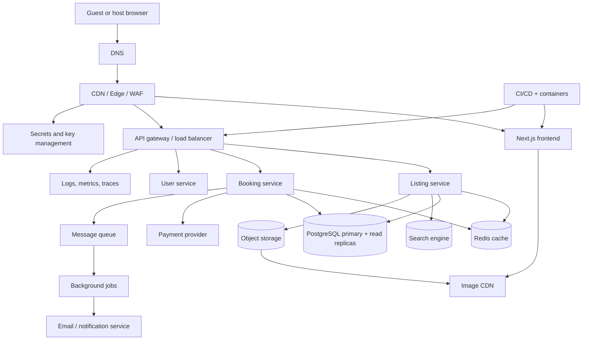

# Production Marketplace Architecture

The assignment UI is intentionally frontend-only, but a production vacation-rental marketplace would separate the browser experience from independently scalable domain services.

## Scaling and operations

- The Next.js frontend is stateless and can scale horizontally behind the edge layer.
- Listing reads use Redis and database read replicas; writes remain owned by the listing service.
- Search indexing is asynchronous and fed by listing updates.
- Original images live in object storage and are resized/delivered through an image CDN.
- Booking writes use idempotency keys, transactional storage, and a payment provider boundary.
- Queue-backed jobs handle notifications, indexing, and housekeeping without blocking requests.
- WAF, rate limiting, secret management, encrypted transport, structured logs, metrics, traces, backups, and disaster recovery are platform concerns shared by each service.

## Repository implementation

This take-home implementation keeps the data local and renders a single listing page. The production diagram is conceptual; no booking, auth, payment, or database services are added to the assignment scope.
